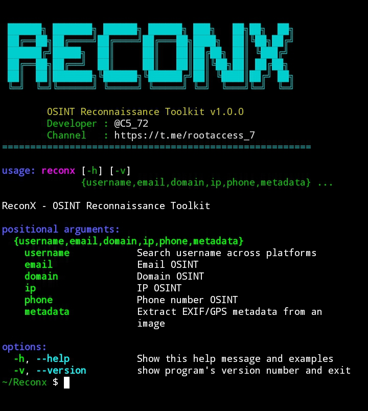

<div align="center">

<br>

# 🕵️‍♂️ ReconX

### 🔍 All-in-One OSINT Reconnaissance Toolkit



**Fast • Lightweight • Command-Line • Built for Termux & Linux**


</div>

---

## 📌 About ReconX

**ReconX** is a powerful, all-in-one **OSINT (Open Source Intelligence)** reconnaissance tool built entirely in Python. It's designed to gather public information fast, right from your terminal — whether you're on **Termux** (Android) or a full **Linux** desktop.

No bloat, no GUI needed — just clean, fast, structured recon output straight to your screen (and optionally saved as JSON).

---

## ⚙️ What It Does

ReconX lets you investigate a target across five core OSINT categories:

| 🎯 Target Type         | 🔎 What ReconX Digs Up                                                                   |
| ---------------------- | ---------------------------------------------------------------------------------------- |
| 👤 **Username**        | Checks presence across 18+ platforms (GitHub, Instagram, Reddit, TikTok, Telegram, etc.) |
| 📧 **Email**           | Validates format and checks for a linked Gravatar profile                                |
| 🌐 **Domain**          | Pulls WHOIS records, DNS entries (A/MX/NS/TXT/CNAME), and resolves IP                    |
| 📡 **IP Address**      | Fetches geolocation, ISP, organization, timezone, and ASN info                           |
| 📱 **Phone Number**    | Identifies carrier, region, and timezone from a number                                   |
| 🖼️ **Image Metadata** | Extracts EXIF data and GPS coordinates from photos                                       |

Every scan can be saved as a clean, timestamped **JSON report** for later analysis.

---

## 👨‍💻 Developer

<div align="center">

**Made with 🖤 by Black Hamo**

<br>

<a href="https://t.me/C5_72">
  
</a>

<a href="https://t.me/rootaccess_7">
  
</a>

</div>

---

## 📥 Installation

### 🤖 Termux (Android)

```bash
pkg update && pkg upgrade -y

pkg install python git -y

git clone https://github.com/Black-HamoX/Reconx

cd reconx

pip install -r requirements.txt

pip install -e .

reconx
```

### 🐉 Kali Linux

```bash
sudo apt update && sudo apt upgrade -y

sudo apt install python3 python3-pip git -y

git clone https://github.com/Black-HamoX/Reconx

cd reconx

pip3 install -r requirements.txt

pip3 install -e .

reconx
```

Once installed, run it from anywhere:

```bash
reconx -h
```

---

## 🚀 Usage

```bash
reconx username john_doe          # 🔍 Username search across platforms

reconx email test@example.com     # 📧 Email OSINT

reconx domain example.com         # 🌐 Domain OSINT (WHOIS + DNS)

reconx ip 8.8.8.8                 # 📡 IP OSINT

reconx phone +201234567890        # 📱 Phone OSINT

reconx metadata photo.jpg         # 🖼️ Image metadata / GPS extraction
```

### 💾 Saving Results

Add `-s` or `--save` to any command to export the results as JSON:

```bash
reconx username john_doe --save
```

📁 Results are saved to:

```text
~/reconx/<target>_<timestamp>.json
```

---

## 🧭 Command Reference

| Command             | Description                                        |
| ------------------- | -------------------------------------------------- |
| `username <target>` | 🔍 Search a username across 18+ platforms          |
| `email <target>`    | 📧 Check email validity and Gravatar               |
| `domain <target>`   | 🌐 WHOIS + DNS + IP resolution                     |
| `ip <target>`       | 📡 Geolocation and ISP info for an IP              |
| `phone <target>`    | 📱 Carrier, region and timezone for a phone number |
| `metadata <path>`   | 🖼️ Extract EXIF/GPS data from an image            |
| `-h`, `--help`      | ❓ Show help message and usage examples             |
| `-v`, `--version`   | 🔢 Show the current version                        |
| `-s`, `--save`      | 💾 Save results as JSON                            |

---

## ⚠️ Disclaimer

ReconX is built **strictly for ethical use** — authorized security research, personal OSINT, and educational purposes only. All data is pulled from **public sources and public APIs**. The developer is not responsible for any misuse of this tool.

---

## © Developer Rights & Attribution

🚫 **This tool may NOT be re-uploaded, redistributed, rebranded, or claimed as your own work** — on GitHub, Telegram, or any other platform — **without explicit permission from the developer**.

✅ If you want to share, fork, or re-upload ReconX anywhere (including Telegram channels), you **must** first contact the developer for permission **and credit the original author, Black Hamo, by name.**

📲 Contact for permission:

<a href="https://t.me/C5_72">
  
</a>

<a href="https://t.me/rootaccess_7">
  
</a>

<br><br>

<div align="center">

**© Black Hamo — All Rights Reserved**

</div>
